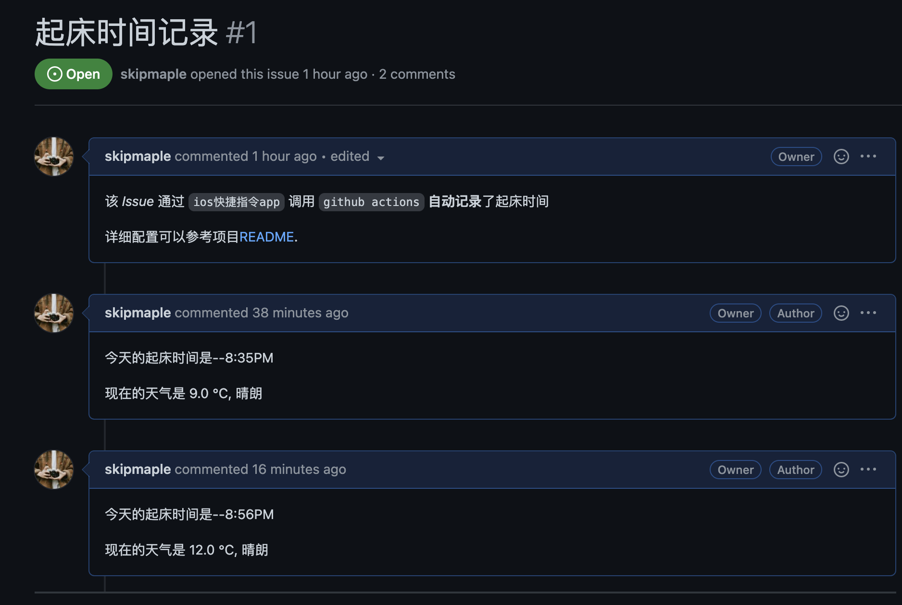
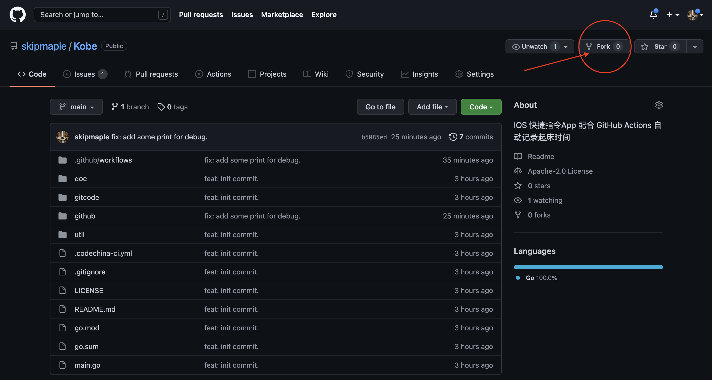
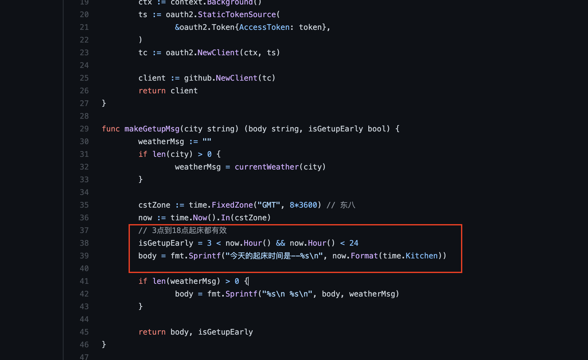
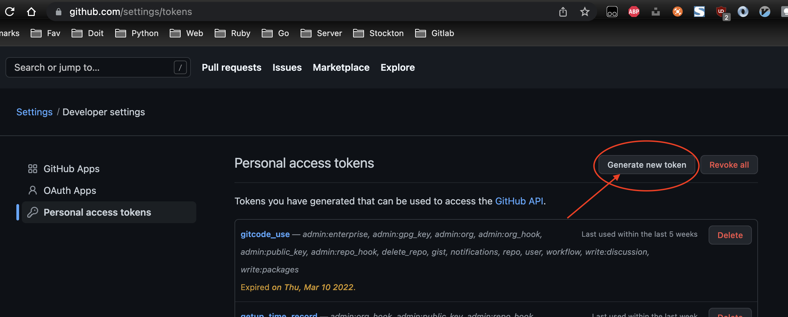
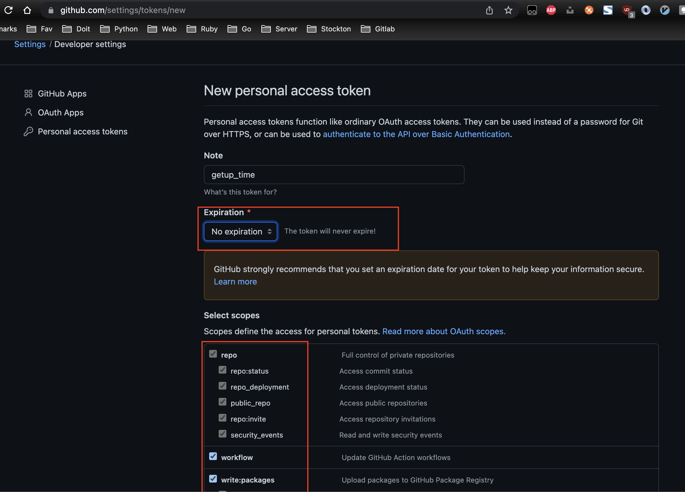
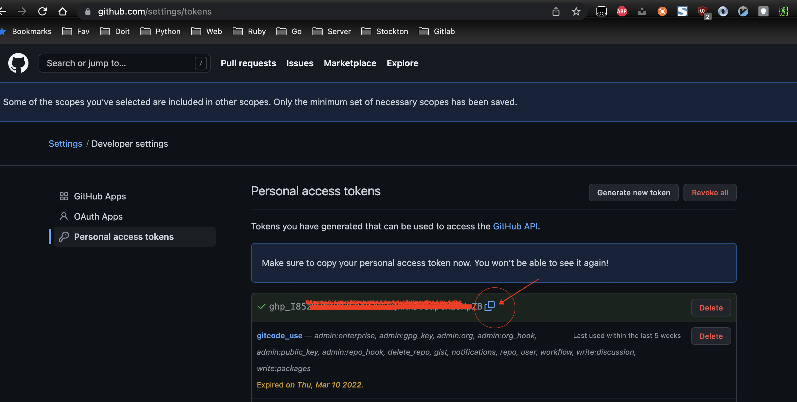
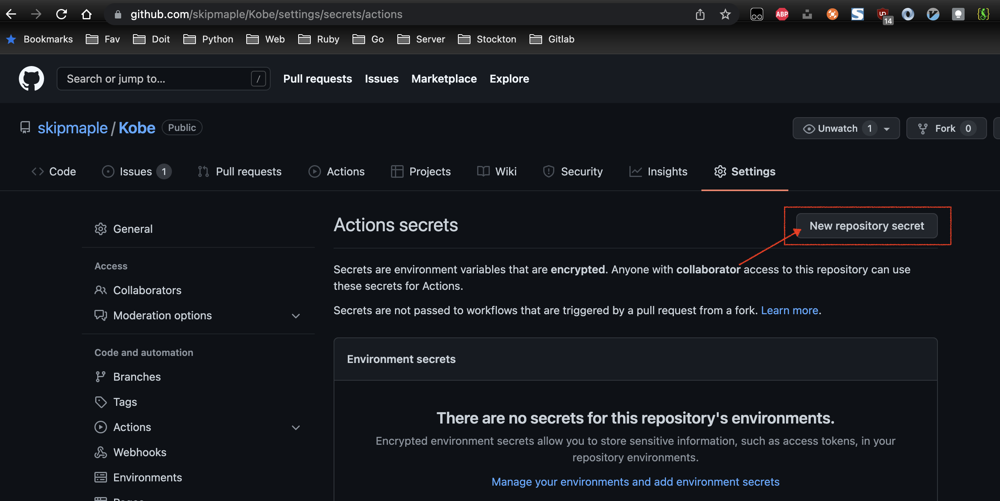
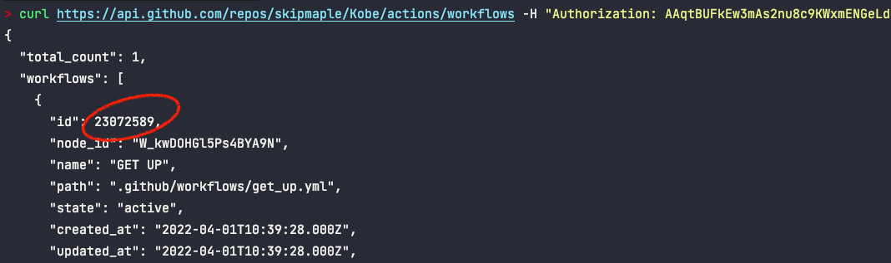
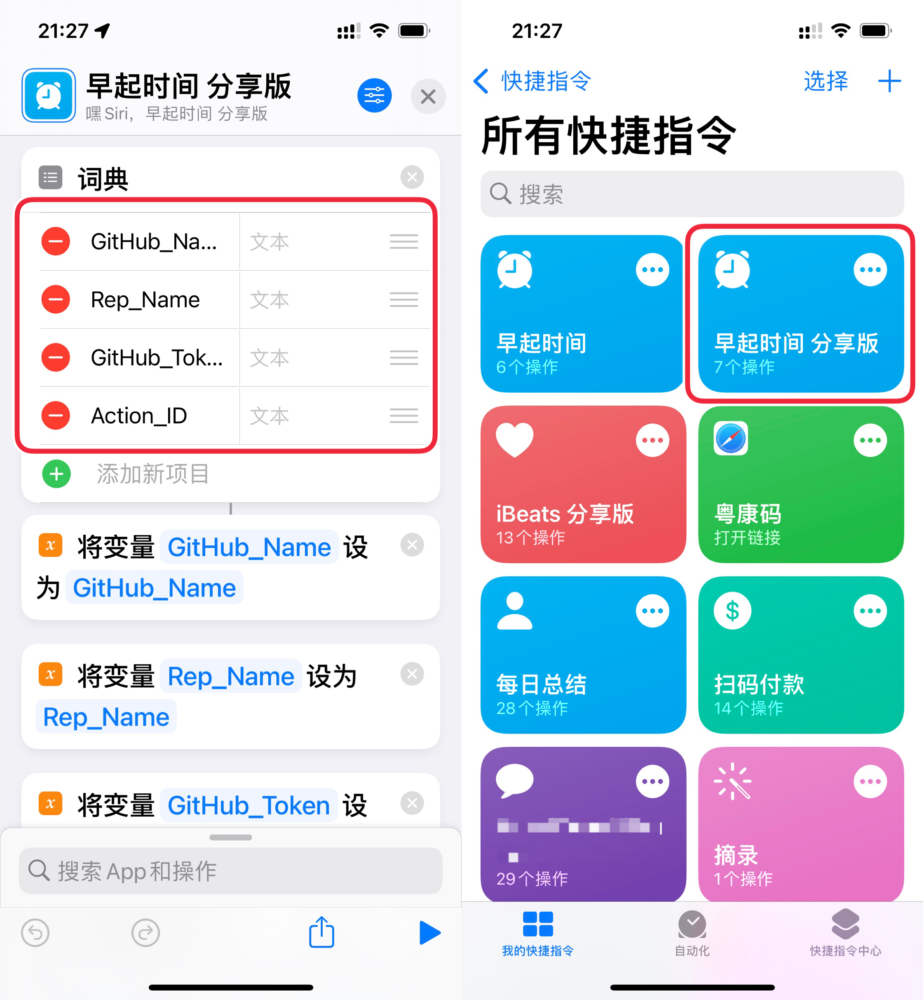
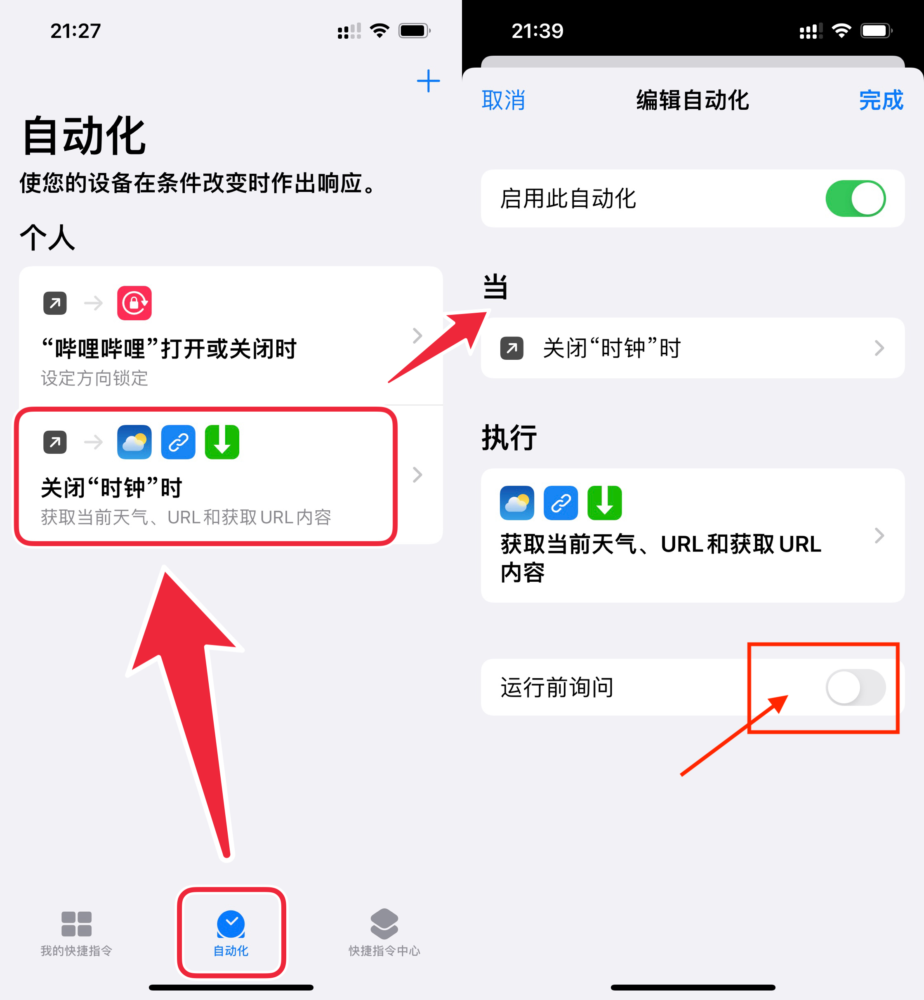

# Get Up 早起记录


**IOS快捷指令 配合 GitHub Actions 自动记录起床时间**


## 描述

Hello 👋

分享一个有意思的小项目 —— 用 ios快捷指令App 和 Github，自动记录每天的起床时间。

它可以实现的效果如下：

#### 每天起床关闭手机闹钟后，自动触发快捷指令 App 运行程序，在 `Issue` 下面会生成一段话，包含**起床时间**、**当前天气**。




下面是实现自动记录起床时间的过程：

## 生成你的早起记录代码仓

从我的 [get_up仓库](https://github.com/skipmaple/Kobe) 中 Fork 出一个你的仓库



## 修改代码

打开 [github/get_up.go](https://github.com/skipmaple/Kobe/blob/main/github/get_up.go) 文件，定位到第 39 行代码，你可以修改中间的「今天的起床时间是--%s\n」，这里的语句，决定了最终在 issue 中生成的内容，你可以将它改为你喜欢的内容。比如修改成 「今天的起床时间是--%s\n 懒猪🐷起床啦，赶紧去跑步，上班不迟到。」

定位到第 38 行代码，设定起床记录的有效记录范围，比如 设置成 5 < now.Hour() && now.Hour() < 10, 这样只有在早上5点到10点范围内关闭闹钟⏰才会有早起记录，其余时间关闭闹钟不会有记录生成。



## 获取 Token

首先打开网页 [https://github.com/settings/tokens](https://github.com/settings/tokens) , 点击右上角的 Generate new token, 生成一个新的 Token。



生成 Token 时，有两个注意点：
1. Token 的**到期时间** 尽量不要设置，
2. 范围 **勾选下面的所有复选框**，将所有权限都打开。



生成的 Token，是一长串英文和数字混合的字符串，点击右侧的复制按钮，复制到剪贴板。



**注意：这个 Token 后面还要用到，最好将 Token 保存到本地的 txt 或 word 文件中。**

打开仓库的 Settings 页面，左侧切换到 Secrets 选项卡，点击右上角的 `New repository secret`



在打开的页面中，Name 输入 **GETUP_TOKEN**，Value 粘贴刚复制到剪贴板的 Token

## 获取 GitHub Actions ID

打开电脑的 __终端应用__（Windows 系统上叫做cmd 或者 Powershell），在终端中粘贴下方的语句。
```shell
curl https://api.github.com/repos/{owner}/{repo}/actions/workflows -H "Authorization: {这里的中文替换成你的的Token}"

# 比如我的格式是:
curl https://api.github.com/repos/skipmaple/Kobe/actions/workflows -H "Authorization: AAqtBUFkEw3mAs2nu8c5KWxmENGeLdabcQPT"
```

粘贴之前，这个语句有 3 处需要替换：

- 你的 GitHub 用户名称
- 你的 GitHub 仓库名称
- 你在前面操作中获得的 Token

粘贴修改好的语句，按下 Enter 键，下方会返回 `id`，这个 `id` 可以复制到本地的 txt 或者 word 中，等下会用到。




## 在手机上添加快捷指令

前面说到，让程序自动运行的触发条件是，关闭手机闹钟。

因此，我们还需要在手机上进行配置，如果你的手机是 iPhone，可以使用快捷指令 App，如果是安卓手机，可以使用 tasker。

关于 tasker 的配置，可以参考下面的文章：

https://chenzaichun.github.io/post/2021-09-21-github-action-trigger-by-curl-tasker/

下面介绍 iPhone 上快捷指令 App 的配置：

将下面的链接复制到 Safari 浏览器打开。

二维码 ➡️ 链接：https://www.icloud.com/shortcuts/703420fd5f2247a089a849f7849282c5

添加快捷指令「早起时间 分享版」后，点击快捷指令右上角的三个小点点，进入快捷指令的配置页面。

我们需要配置 4 个值：

- GitHub_Name：填入你的 GitHub ID
- Rep_Name：填入你创建的仓库名
- GitHub_Token：填入前面获取的 Token
- Action_ID：填入前面从终端获得的 ID

配置好 4 个参数后，回到「所有快捷指令」的页面，点击快捷指令「早起时间 分享版」，程序就会自动运行。



稍等一小会，回到 GitCode 仓库的 issue 选项卡，在评论区就能见到程序运行后的结果。

如果想让快捷指令在每次关闭闹钟后自动运行，可以切换到快捷指令的「**自动化**」页面，研究刚添加的快捷指令，在自动化里面创建一个同样的命令。



以上就是全部配置过程

### 欢迎 fork项目 或者 提出issue交流呀 🤝
