# Get Up 早起记录

GitCode 搭配快捷指令 自动记录起床时间

Hello 各位好

今天想和各位分享一个有意思的小项目——用快捷指令 App 和 GitCode，自动记录每天的起床时间。

它可以实现的效果如下：

#### 每天起床关闭手机闹钟后，自动触发快捷指令 App 运行程序，在 `GitCode Issue` 下面会生成一段话，包含**起床时间**。

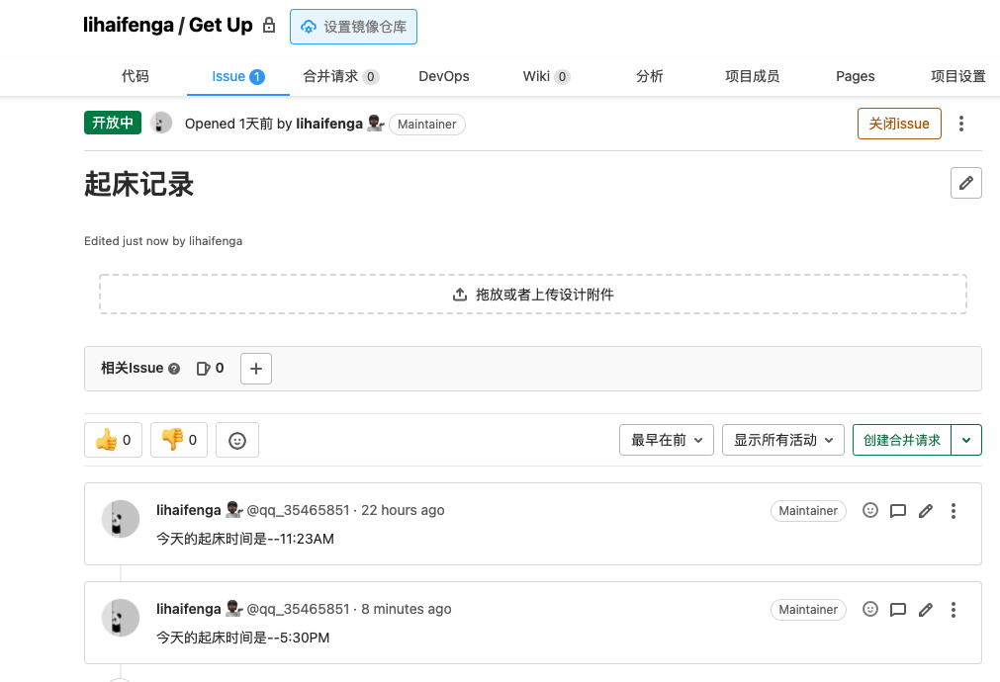


下面是实现自动记录起床时间的过程：

## 生成你的早起记录代码仓

从我的 [get_up仓库](https://gitcode.net/qq_35465851/get_up.git) 中 Fork 出一个你的仓库

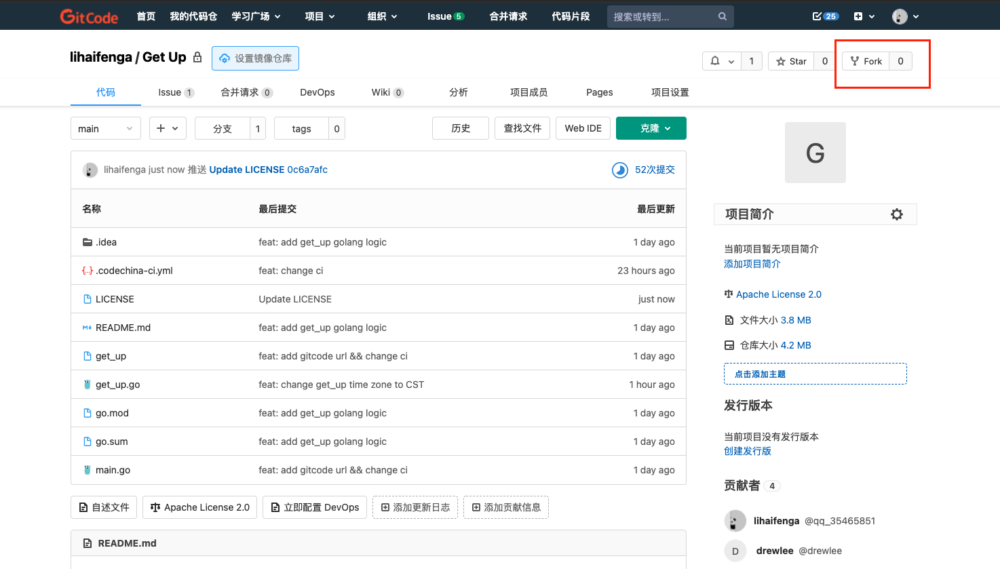

## 修改代码

打开复制的 `get_up.go` 文件，定位到第 23 行代码，你可以修改中间的「今天的起床时间是--%s\n」，这里的语句，决定了最终在 issue 中生成的内容，你可以将它改为你喜欢的内容。比如修改成 「今天的起床时间是--%s\n 懒猪🐷起床啦，赶紧去跑步，上班不迟到。」

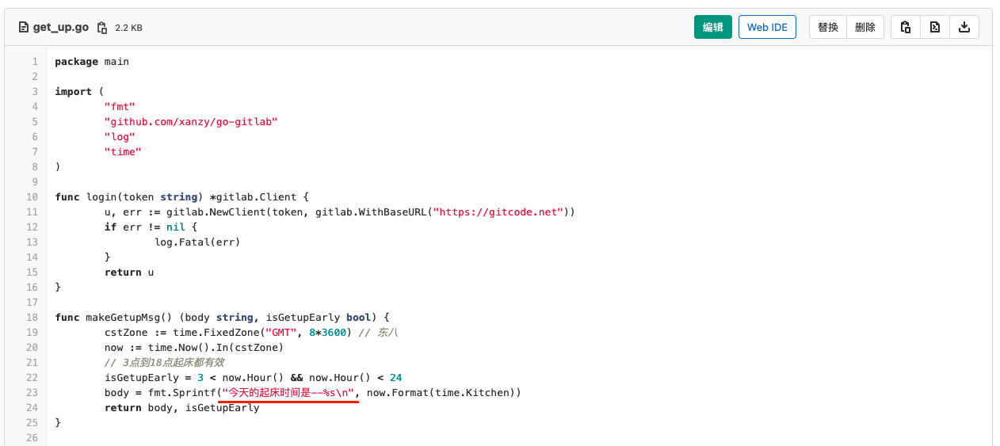

定位到第 22 行代码，设定起床记录的有效记录范围，比如 设置成 5 < now.Hour() && now.Hour() < 10, 这样只有在早上5点到10点范围内关闭闹钟⏰才会有早起记录，其余时间关闭闹钟不会有记录生成。

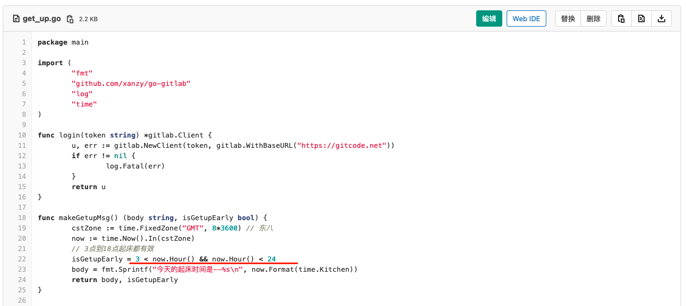

## 创建 issue

点击切换到 issue 选项卡，接着点击页面右侧的绿色按钮 **新建issue**，创建一个 issue。

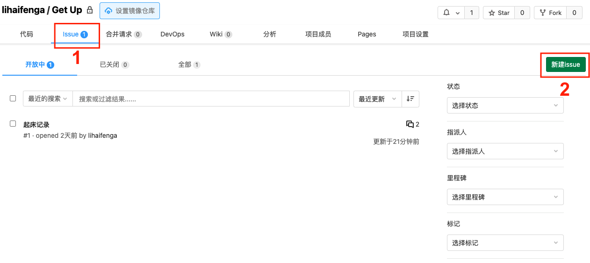

创建 issue 时，需要填入 issue 标题和内容，填入的内容可参考下图👇：

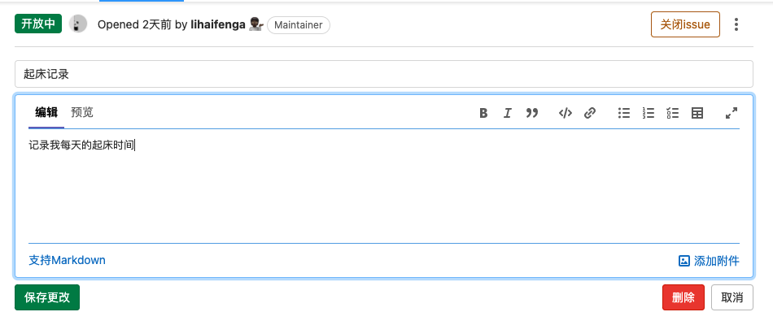

## 获取 Token

首先打开网页 `https://gitcode.net/-/profile/personal_access_tokens`，生成一个新的 Token。

生成 Token 时，有两个注意点：
1. Token 的**到期时间** 尽量不要设置，
2. 范围 **勾选下面的所有复选框**，将所有权限都打开。

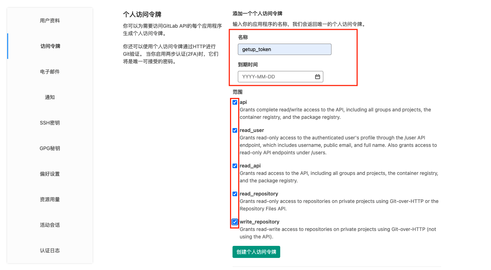

生成的 Token，是一长串英文和数字混合的字符串，点击右侧的复制按钮，复制到剪贴板。

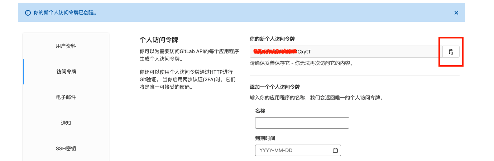

**注意：这个 Token 后面还要用到，最好将 Token 保存到本地的 txt 或 word 文件中。**

## 设置Devops变量
1. 项目设置 -> DevOps
2. 填入 
   1. 键 -> `ISSUE_ID`               值 -> [ 刚刚创建的issue_id(默认为1) ]
   2. 键 -> `PERSONAL_ACCESS_TOKEN` 值 -> [ 刚刚创建的Token值 ]

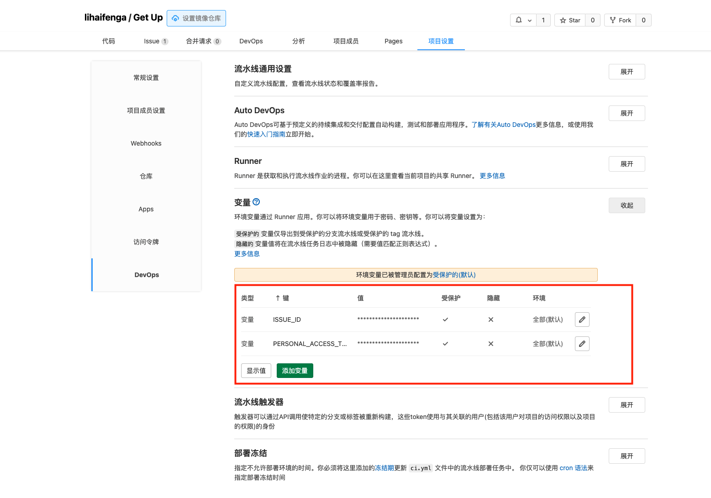

## 获取 Project ID
1. 点击 **项目设置**
2. 项目ID 即为 project_id, 后面会用到
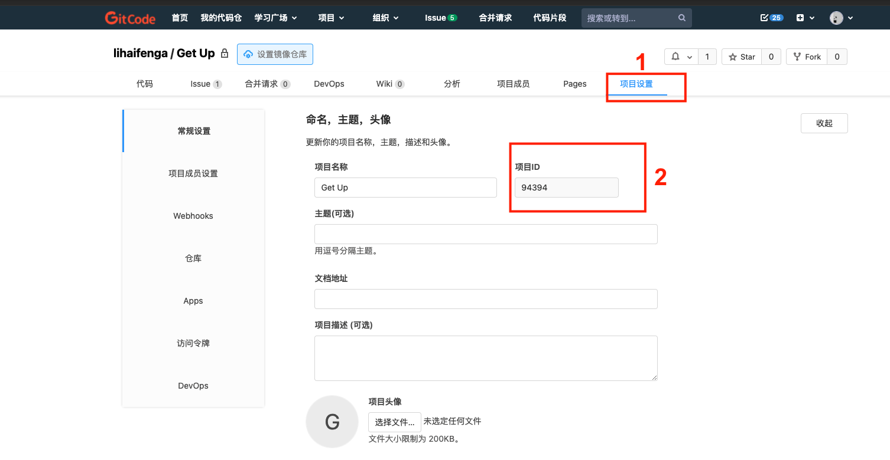

## 获取 GitCode CI/CD 流水线任务ID(job_id)

1. 项目页面鼠标停在 `DevOps` 按钮
2. 点击 `流水线任务`
3. 点击第一个已通过的 流水线任务

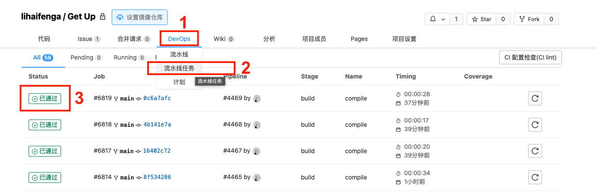

找到浏览器访问地址栏的 url :
```txt
https://gitcode.net/qq_35465851/get_up/-/jobs/6819
```
那么我的 job_id 就是 **6819**

这个 job_id 可以复制到本地的 txt 或者 word 中，等下会用到。

## 在手机上添加快捷指令

前面说到，让程序自动运行的触发条件是，关闭手机闹钟。

因此，我们还需要在手机上进行配置，如果你的手机是 iPhone，可以使用快捷指令 App，如果是安卓手机，可以使用 tasker。

关于 tasker 的配置，可以参考下面的文章：

https://chenzaichun.github.io/post/2021-09-21-github-action-trigger-by-curl-tasker/

下面介绍 iPhone 上快捷指令 App 的配置：

将下面的链接复制到 Safari 浏览器打开。

二维码 ➡️ 链接：https://www.icloud.com/shortcuts/68493c10bfed49a585dc1eac94ff9be1

添加快捷指令「早起时间 分享版」后，点击快捷指令右上角的三个小点点，进入快捷指令的配置页面。

我们需要配置 4 个值：

* PRIVATE-TOKEN：填入你的 private_token
* PROJECT-ID：填入你创建的仓库id
* JOB-ID：填入前面获取的 job_id

配置好 3 个参数后，回到「所有快捷指令」的页面，点击快捷指令「早起时间 分享版」，程序就会自动运行。

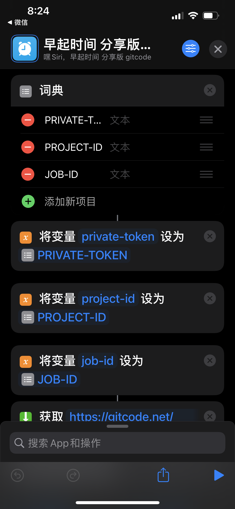

稍等一小会，回到 GitCode 仓库的 issue 选项卡，在评论区就能见到程序运行后的结果。

如果想让快捷指令在每次关闭闹钟后自动运行，可以切换到快捷指令的「**自动化**」页面，研究刚添加的快捷指令，在自动化里面创建一个同样的命令。

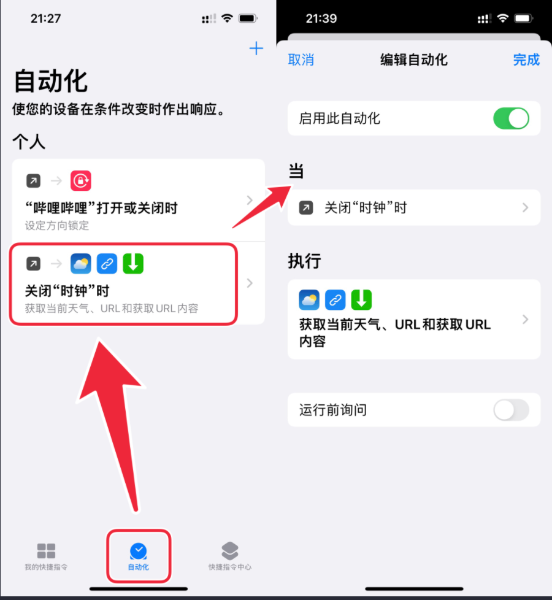
 